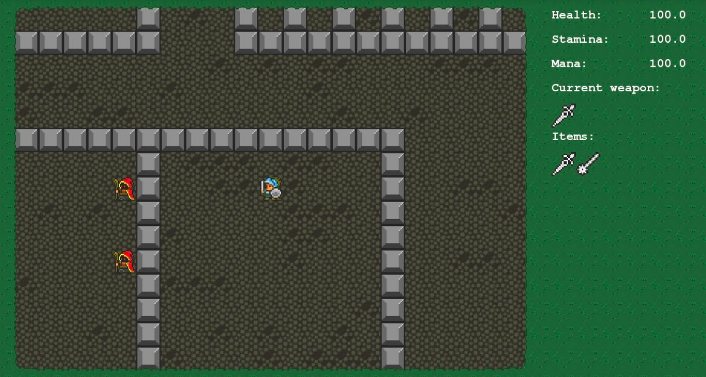

# Простая 2D-игра в жанре Roguelike

## Постановка задачи
Написать Roguelike 2D-игру с лабиринтом из комнат с помощью PyGame.

Игроку необходимо выбраться из лабиринта, состоящего из соединенных между собой квадратных / прямоугольных комнат нескольких разных типов. 

Чтение карты общего лабиринта и карты комнат разных типов происходит из текстовых файлов. Одна комната целиком помещается на экран. Из очередной комнаты игроку доступно от 1 до 4 выходов. 

## Интерфейсная модель приложения

### Базовые пункты
* Реализация различных элементов в комнате:
    * пустое пространство;
    * стена;
    * пол;
    * игрок;
    * выход из комнаты;
    * выход из всего лабиринта;
    * ключи, которые позволяют открывать закрытые выходы из комнат;
    * сокровища, которые игрок может подобрать;
    * подсказки (там, где они возможны);
    * ловушки в полу. 
* Отображение всех игровых элементов разными изображениями (тайлами/спрайтами). 
* Реализация движения и взаимодействия с окружением игрока при помощи управления с клавиатуры (W, A, S, D). 
* Релизация взаимодействия со стенами: игрок не должен проходить сквозь стены.
* При попадании в пустоту/ловушку игрок должен умирать: необходимо вывести сообщение о проигрыше и завершить игру.
* Если игрок достиг выхода из лабиринта, необходимо вывести сообщение об успешном окончании игры.
* Базовый экран закрузки:
  * объяснение управления, элементов уровня, цели игры;
  * выбор героя;

### Возможные дополнительные пункты
* Реализация анимации статических объектов.
* Реализация анимации динамических объектов:
  * Походка героя;
  * Открытие дверей.
* Реализация *разных* врагов:
  * патрулирующие по маршруту;
  * двигающиеся на игрока;
  * атакующие с дистанции;
  * отбегающие от игрока.
* Реализация эффекта перехода между комнатами: постепенное угасание и появление игровой карты 
* Добавление источников света (факелы, лампы и т.д.), которые освещают соседние тайлы в некотором радиусе.
* Реализация и графическое отображение инвентаря.
* Графическое отображение характеристик игрока и соответствующие им игровые механики - например, если выводится здоровье, то игрок может его потерять (ловушки, враги) и, возможно, восстановить. 
* Механика ближнего боя с анимацией.
* Механика дальнего боя (стрелковое оружие и/или магия - огненные шары, волшебные стрелы и т.д.) с анимацией летящего снаряда.
* Визуальные эффекты боя - “вылетающие” спрайты цифр повреждений, искры, “тряска” экрана и т.п.
* Финальный босс игры с какой-то оригинальной механикой для босса.
* Реализация НПС персонажей с поддержкой диалогов:
  * Ответы героя могут быть списком выбора и влиять на реплики НПС.
