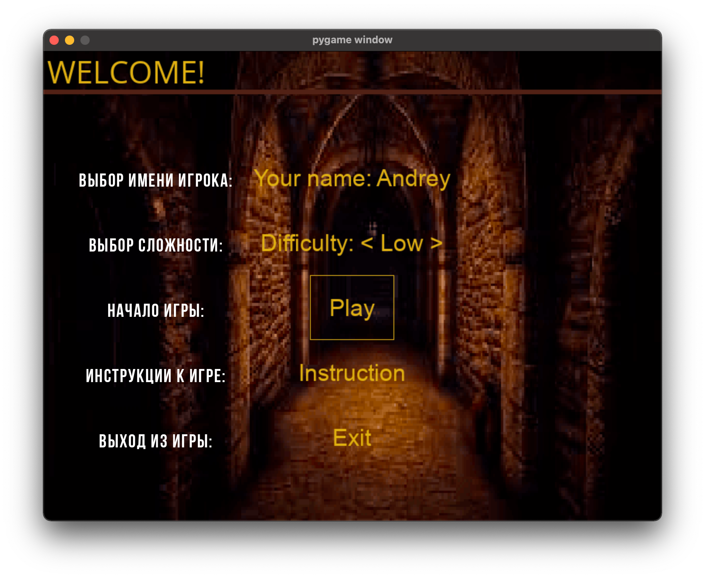
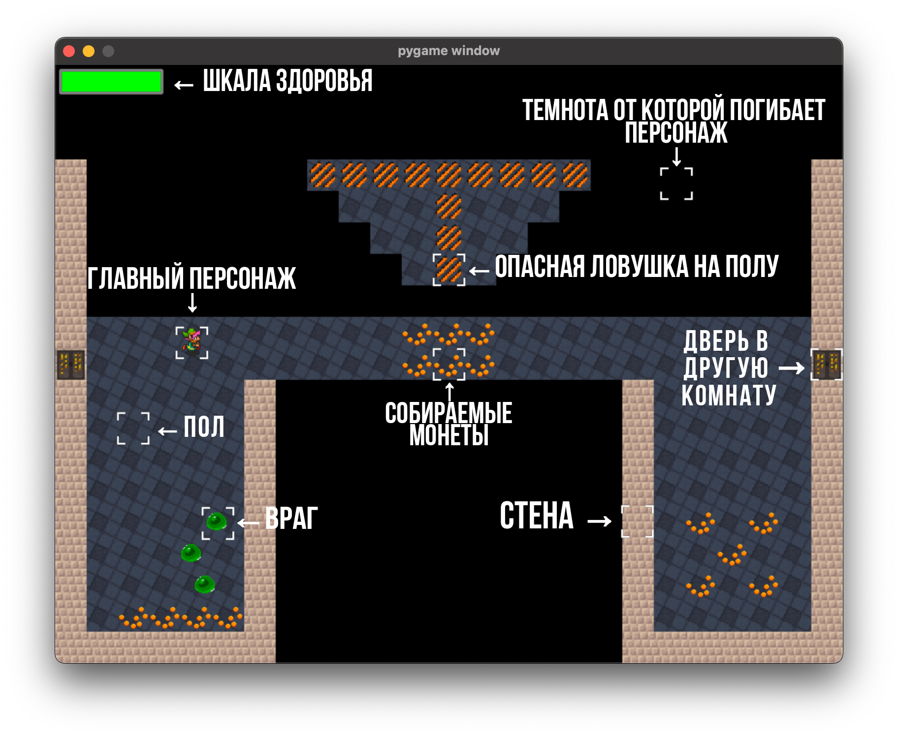
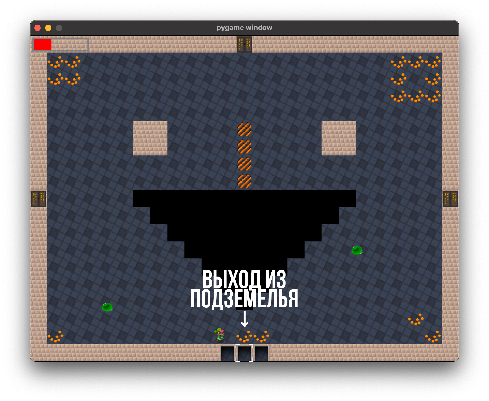
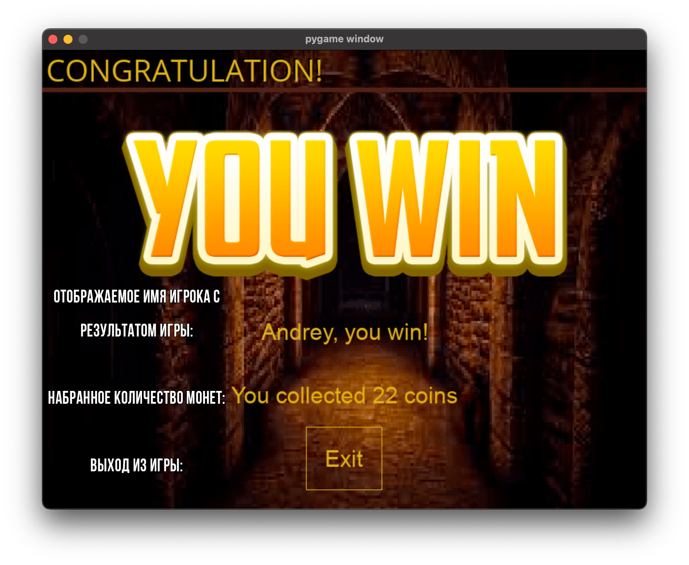
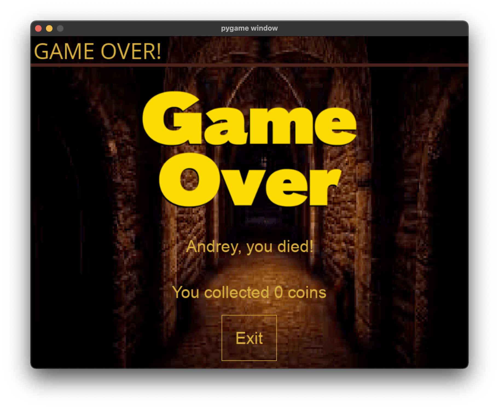

# Простая 2D-игра в жанре Roguelike

## Оглавление
1. [Постановка задачи](#introduction)
2. [Интерфейсная модель приложения](#paragraph1)
    1. [Базовые пункты](#subparagraph11)
    2. [Возможные дополнительные пункты](#subparagraph12)
3. [Финальная версия приложения](#paragraph2)
	1. [Игровая инструкция](#subparagraph21)
	2. [Разработанный интерфейс игры](#subparagraph22)
4. [RoguelikeGame Wiki](https://github.com/CatherineFish/RoguelikeGame/wiki)

## Постановка задачи 
Написать Roguelike 2D-игру с лабиринтом из комнат с помощью PyGame.

Игроку необходимо выбраться из лабиринта, состоящего из соединенных между собой квадратных / прямоугольных комнат нескольких разных типов. 

Чтение карты общего лабиринта и карты комнат разных типов происходит из текстовых файлов. Одна комната целиком помещается на экран. Из очередной комнаты игроку доступно от 1 до 4 выходов. 

## Интерфейсная модель приложения 
Пример Roguelike игры:

### Базовые пункты 
* Реализация различных элементов в комнате:
    * пустое пространство;
    * стена;
    * пол;
    * игрок;
    * выход из комнаты;
    * выход из всего лабиринта;
    * ключи, которые позволяют открывать закрытые выходы из комнат;
    * сокровища, которые игрок может подобрать;
    * подсказки (там, где они возможны);
    * ловушки в полу. 
* Отображение всех игровых элементов разными изображениями (тайлами/спрайтами). 
* Реализация движения и взаимодействия с окружением игрока при помощи управления с клавиатуры (W, A, S, D). 
* Релизация взаимодействия со стенами: игрок не должен проходить сквозь стены.
* При попадании в пустоту/ловушку игрок должен умирать: необходимо вывести сообщение о проигрыше и завершить игру.
* Если игрок достиг выхода из лабиринта, необходимо вывести сообщение об успешном окончании игры.
* Базовый экран закрузки:
  * объяснение управления, элементов уровня, цели игры;
  * выбор героя;

### Возможные дополнительные пункты 
* Реализация анимации статических объектов.
* Реализация анимации динамических объектов:
  * Походка героя;
  * Открытие дверей.
* Реализация *разных* врагов:
  * патрулирующие по маршруту;
  * двигающиеся на игрока;
  * атакующие с дистанции;
  * отбегающие от игрока.
* Реализация эффекта перехода между комнатами: постепенное угасание и появление игровой карты 
* Добавление источников света (факелы, лампы и т.д.), которые освещают соседние тайлы в некотором радиусе.
* Реализация и графическое отображение инвентаря.
* Графическое отображение характеристик игрока и соответствующие им игровые механики - например, если выводится здоровье, то игрок может его потерять (ловушки, враги) и, возможно, восстановить. 
* Механика ближнего боя с анимацией.
* Механика дальнего боя (стрелковое оружие и/или магия - огненные шары, волшебные стрелы и т.д.) с анимацией летящего снаряда.
* Визуальные эффекты боя - “вылетающие” спрайты цифр повреждений, искры, “тряска” экрана и т.п.
* Финальный босс игры с какой-то оригинальной механикой для босса.
* Реализация НПС персонажей с поддержкой диалогов:
  * Ответы героя могут быть списком выбора и влиять на реплики НПС.

## Финальная версия приложения 
В финальной версии Roguelike 2D-игры удалось добиться следующих результатов:
* Разработаны следующие элементы игры:
	* главный персонаж;
    * пустое пространство;
    * стена;
    * пол;
    * выход из комнаты;
    * выход из всего лабиринта;
    * сокровища, которые игрок может подобрать;
    * ловушки в полу; 
    * враги.
* Отображение всех игровых элементов разными изображениями (тайлами/спрайтами). 
* Движения и взаимодействия с окружением игрока при помощи управления с клавиатуры (W, A, S, D). 
* Механика ближнего боя персонажа при помощи нажатия на клавишу SPACE. 
* Реализована потеря здоровья и смерть персонажа.
* Реализованы анимации статических и динамических объектов.
* В игре присутвует смена экранов:
	* стартовое меню
	* игровой экран
	* экран победы или поражения игрока

### Игровая инструкция 
Твоя цель - найти выход из подземелья!

Управление:
* W - вверх
* S - вниз
* D - вправо
* A - влево
* SPACE - атаковать врага

Подсказки:
* Собирай монеты, чтобы получить больше очков!
* Темнота смертельна для тебя!
* Ловушки могут ранить тебя!
* Враги тоже могут ранить тебя, но ты можешь убить их!

### Разработанный интерфейс игры 
1. Пример Стартового меню:

2. Примеры Игрового экрана:

3. Примеры Финального экрана:

Экран Победы:

Экран Поражения:

