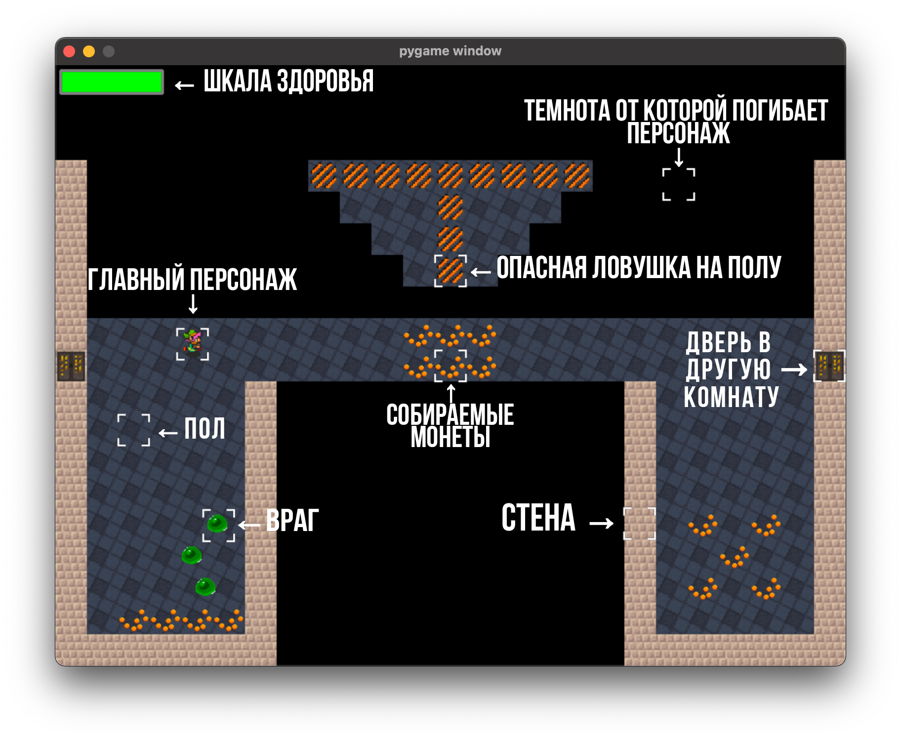

.. RoguelikeGame documentation master file, created by
   sphinx-quickstart on Fri Jun  4 20:54:01 2021.
   You can adapt this file completely to your liking, but it should at least
   contain the root `toctree` directive.

Добро пожаловать на страницу документации RoguelikeGame!
========================================================

В этой простой игре необходимо найти выход из лабиринта, состоящего из соединенных между собой квадратных/прямоугольных комнат нескольких разных типов.
Из очередной комнаты игроку доступно от 1 до 4 выходов. В комнате могут встречаться опасные ловушки и враги, смертельная темнота и драгоценные монеты.

.. toctree::
   :maxdepth: 2
   :caption: Содержание:

   menu
   base

Индексы и таблицы
==================

* :ref:`genindex`
* :ref:`modindex`
* :ref:`search`
